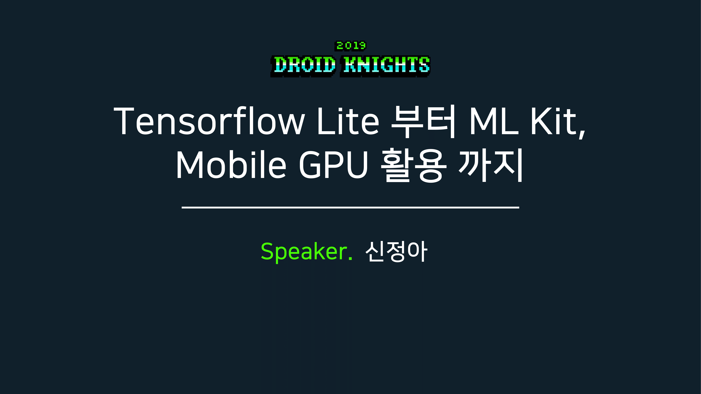
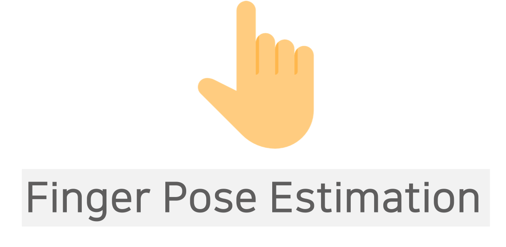
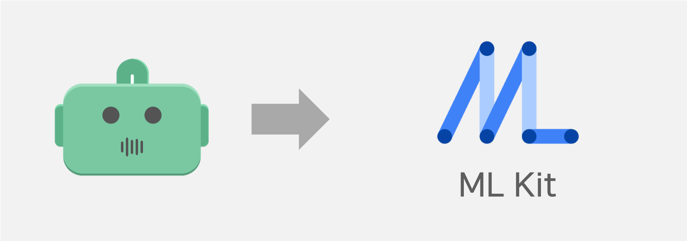
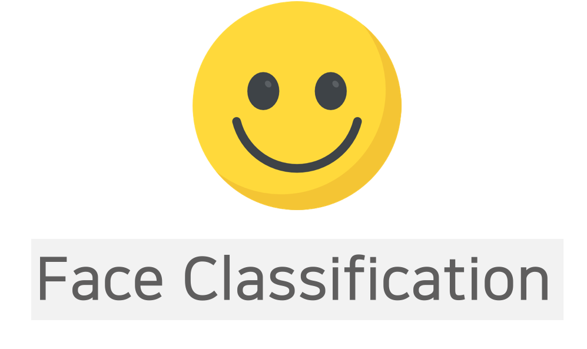
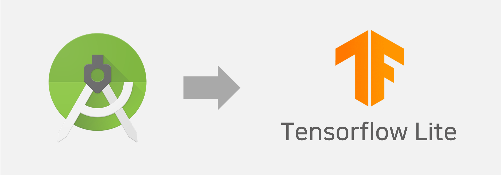
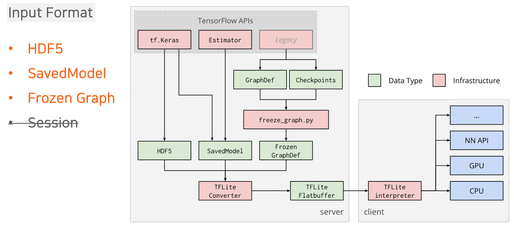
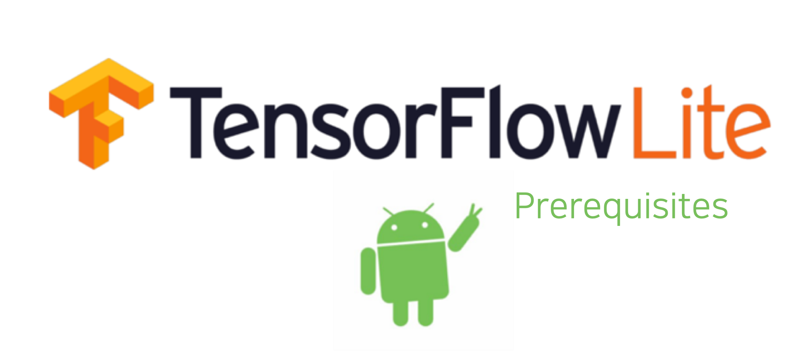
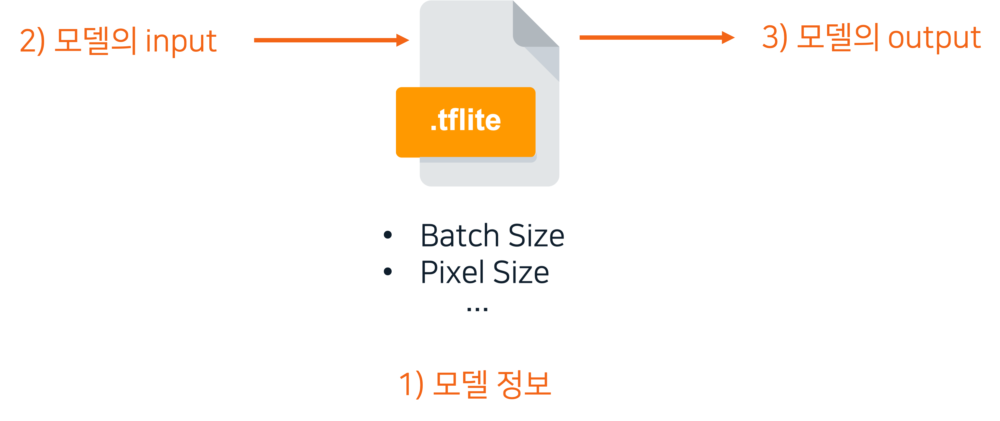

  

# Awesome Machine Learning DEMOs with Android

본 저장소는 안드로이드 환경에서 Tensorflow Lite와 ML Kit을 활용하는 방법과 예제들에 대해 다룹니다. 기본 언어 제공이 한국어이므로 다른 언어로의 번역을 원하시면 아래의 옵션을 선택해주세요!

This repository provides several guides and examples to utilize the Tensorflow Lite and ML Kit in an Android environment. Since the basic language support is Korean, plz click into an option below if you want to translate to another languages!

  

## 목차

- [모바일 머신러닝이 무엇인가요?](#모바일-머신러닝이-무엇인가요)
- [Android를 위한 ML 프레임워크와 도구들](#Android를-위한-ML-프레임워크와-도구들)
  - [Tensorflow Lite 알아보기](#Tensorflow-Lite-알아보기)
  - [ML Kit 알아보기](#ML-Kit-알아보기)
- [모바일 머신러닝 개발 프로세스](#모바일-머신러닝-개발-프로세스)
- [함께 만들어 보는 모바일 머신러닝 앱!](#함께-만들어-보는-모바일-머신러닝-앱)
  - 무엇을 만드나요?
  - Tensorflow Lite 실행 흐름도
  - ML Kit 실행 흐름도
- [모델 실행 예제](#모델-실행-예제)
  - [Object Detection](#Object-Detection)
    - Quantized COCO SSD MobileNet v1
  - [Pose Estimation](#Pose-Estimation)
    - Body Pose Estimation
    - Body Pose Estimation with Mobile GPU
    - FingerTip Estimation
    - Forward Head Posture Estimation
 - [Face Detection](#Face-Detection)
 - [Face Recognition](#Face-Recognition)
 - [Text Recognition](#Text-Recognition)
- [Performance Measure](#Performance-Measure)
  - [Perfomance Indicator](#Performance-Indicator)
  - [Unit Test](#Unit-Test)
- [See also](#See-Also)

## 모바일 머신러닝이 무엇인가요?

모바일에서 머신러닝 추론을 할 수 있는 방법은 크게 두 가지로 나뉩니다.

- On-Device **(Serverless)**

    기기 내부의 메모리, CPU/GPU 자원등을 사용하여 머신러닝 추론 결과를 얻는 방법입니다.

- Cloud **(Server)**

    클라우드 혹은 온프레미스 서버를 통해 머신러닝 추론 결과를 얻는 방법입니다. 퍼블릭 클라우드의 편리한 ML PaaS(Platform-as-a-Service) 엔진들을 활용하면 쉽게 클라우드를 통해 머신러닝 추론을 하는 환경을 만들어볼 수 있습니다. IaaS(Infra-as-a-Service) 단 부터 End-to-End 머신러닝을 위한 플랫폼을 구축하기도 합니다.

  **클라우드별 MLaaS(Machine-Learning-as-a-Service)**

  - [Amazon Sagemaker](https://aws.amazon.com/ko/sagemaker/)

  - [Azure Machine Learning Studio](https://studio.azureml.net/)

  - [Google Cloud Machine Learning Engine](https://cloud.google.com/ml-engine/)

    

## Android를 위한 ML 프레임워크와 도구들

- [Tensorflow Lite](https://www.tensorflow.org/mobile/tflite/), ~~[Tensorflow Mobile](https://www.tensorflow.org/mobile/)~~ `DEPRECATED`
- [ML Kit](https://developers.google.com/ml-kit/)
- [Caffe2Go](https://caffe2.ai/docs/mobile-integration.html)
- [Mace](https://mace.readthedocs.io/en/latest/user_guide/basic_usage.html)
- [fritz](https://www.fritz.ai/)

## 모바일 머신러닝 개발 프로세스

**On-Device** 모바일 머신러닝 앱 개발을 하기 위한 프로세스는 아래와 같습니다.

- Training

    모델을 개발하고, 데이터셋을 통해 학습시킵니다. 모바일에서 가용할 수 있는 딥러닝 모델 종류에는 **FNN** (Feedforward Neural Network), **CNN** (Convolutional Neural Network) 가 대표적입니다. 

- Conversion

    모바일에 이식될 수 있도록 딥러닝 모델을 경량화 합니다. 대개 각기 프레임워크별로 모델을 경량화할 수 있는 converter나 exporter를 지니고 있습니다.

- Inference

    경량화 된 딥러닝 모델을 모바일 프로젝트 내에 이식하여 모델 추론과 Business Logic / Presentation Logic 표현을 위한 시스템 아키텍처를 설계합니다.

## 함께 만들어 보는 모바일 머신러닝 앱!

   Tensorflow Lite과 ML Kit을 활용한 간단한 데모앱을 만드는 과정을 되짚어 보며 모바일 머신러닝 앱이 만들어지는 과정에 대해 알아보도록 하겠습니다. 본 과정은 **Droid Knights 2019** (2019.04.05) 에서 이루어졌던 Live Demo를 기반으로 합니다.

 

  <a href = "https://www.slideshare.net/ShinJeongah/droid-knights-2019-tensorflow-lite-ml-kit-mobile-gpu-140070058">
      
    <b>슬라이드 바로 가기</b>
  </a>

### 무엇을 만드나요?

| 사용 모델                                                    | DEMO                                                         | 설명                                                         |
| ------------------------------------------------------------ | ------------------------------------------------------------ | ------------------------------------------------------------ |
| 

 | 

 | 

 |
| 
 | 

 | 

 |

### Tensorflow Lite 실행 흐름도

1. Frozen Graph (확정된 모델 변화본의 기록)를 통해 Finger Pose Estimation 모델의 경량화 파일(.tflite)을 추출합니다.

2. Tensorflow Lite 추론을 위한 안드로이드 프로젝트 환경을 세팅합니다.

 

1. Android Studio 3.0 이상
2. Android Studio SDK 버전 26 이상
3. Android NDK 버전 14 이상
4. API Level 26 이상의 테스트 기기

3. 모델의 정보와 입/출력에 대해 파악합니다.

 

